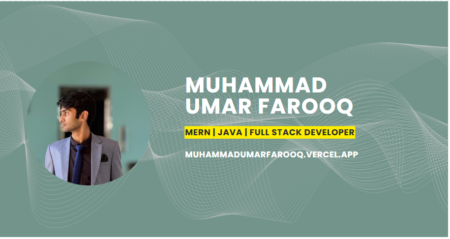

<div align="center">



# Muhammad Umar Farooq

### Software Engineer · Full-Stack & Mobile Developer

**Flutter • React • Node.js • MERN • Firebase • PostgreSQL**

<p>
  <a href="https://muhammadumarfarooq.vercel.app">
    <strong>🎨 View My Portfolio →</strong>
  </a>
  &nbsp;&nbsp;•&nbsp;&nbsp;
  <a href="https://www.linkedin.com/in/muhammad-umar-farooq-dev/">
    LinkedIn
  </a>
  &nbsp;&nbsp;•&nbsp;&nbsp;
  <a href="mailto:thefarooq.dev@gmail.com">
    Email
  </a>
</p>

</div>

---

## 👨‍💻 About Me

I'm a **Software Engineer** focused on building real-world web and mobile products.

I've worked across **20+ meaningful client projects**, alongside numerous smaller freelance development engagements. My work spans mobile applications, full-stack platforms, dashboards, marketplaces, management systems, and product-focused interfaces.

I enjoy taking an idea from **concept → architecture → implementation → polished user experience**.

### What I Work With

* 📱 **Mobile:** Flutter, Dart
* 🌐 **Frontend:** React, TypeScript, JavaScript, HTML, CSS, Tailwind
* ⚙️ **Backend:** Node.js, Express.js, REST APIs
* 🗄️ **Databases:** PostgreSQL, MongoDB, SQL, NoSQL, Firebase
* 🔐 **Architecture:** Authentication, authorization, role-based systems, MVC
* 🛠️ **Tools:** Git, GitHub, VS Code

---

## 🎨 See My UI & Product Work

If you want to see the **actual interfaces and products I've designed and built**, start here:

### 👉 [View My Portfolio](https://muhammadumarfarooq.vercel.app)

My portfolio showcases the visual side of my work — including application interfaces, dashboards, mobile experiences, and complete product concepts.

**GitHub shows how I build it.
My portfolio shows what I can make it look like.**

---

## 🚀 Featured Projects

### 🍽️ Foodler

A full-stack restaurant management and ordering platform built around real restaurant workflows.

**Highlights:**

* Restaurant marketplace and storefronts
* Menu management
* Cart and order management
* Kitchen Display System
* Bar operations
* Table management & reservations
* Delivery workflow
* Staff roles and permissions
* Reports & analytics
* JWT authentication and role-based authorization
* PostgreSQL / SQLite database support
* Image upload and processing

**Stack:** `React` `TypeScript` `Node.js` `Express` `PostgreSQL` `SQLite` `Tailwind`

👉 [Explore Foodler](https://github.com/farooqintheloop/Foodler)

---

### 🎓 LMS

A learning management platform built with Flutter and Firebase, designed around structured learning and course management workflows.

**Stack:** `Flutter` `Dart` `Firebase`

👉 [Explore LMS](https://github.com/farooqintheloop/LMS)

---

### 🔗 Dependency Visualizer

A TypeScript-based dependency visualization tool designed to make project relationships easier to understand.

**Stack:** `TypeScript`

👉 [Explore Dependency Visualizer](https://github.com/farooqintheloop/Dependency-Visualizer)

---

## 🧩 Engineering Focus

I particularly enjoy working on systems involving:

* 🏗️ Full-stack application architecture
* 📱 Cross-platform mobile development
* 🔐 Authentication & authorization
* 👥 Role-based access control
* 📊 Dashboards & analytics
* 🔄 REST API design
* 🗄️ Database-driven applications
* 🎨 Product UI & responsive interfaces
* ⚡ Operational workflows and management systems

---

## 📈 How I Approach Projects

```text
Idea
 ↓
Understand the Problem
 ↓
Design the User Experience
 ↓
Plan the Architecture
 ↓
Build the Backend & APIs
 ↓
Build the Product Interface
 ↓
Connect Everything
 ↓
Test & Refine
 ↓
Ship
```

I care about both sides of the equation:

**How the system works** and **how the user experiences it.**

---

## 📫 Let's Connect

I'm currently interested in opportunities involving **Software Engineering, Full-Stack Development, Flutter, and product-focused application development**.

<div align="center">

**🌐 Portfolio:**
https://muhammadumarfarooq.vercel.app

**💼 LinkedIn:**
https://www.linkedin.com/in/muhammad-umar-farooq-dev/

**📧 Email:**
[umar57988@gmail.com](mailto:thefarooq.dev@gmail.com)

</div>
